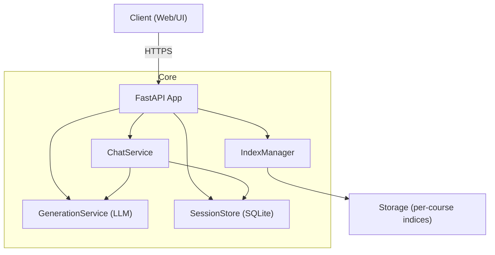

# Moodle Course Bot – Technical Documentation

This documentation is the canonical technical reference for the project. It is structured for quick onboarding, safe operations, and future scalability.

> Tip: All diagrams are Mermaid and render on GitHub. Place screenshots and UI images in `docs/images/` and reference them inline.

## Table of Contents
- [1. Overview](#1-overview)
- [2. Architecture](#2-architecture)
- [3. API Reference](#3-api-reference)
- [4. Data Model](#4-data-model)
- [5. Ingestion and Indexing](#5-ingestion-and-indexing)
- [6. Chat and Session Management](#6-chat-and-session-management)
- [7. Storage Strategy and Scale](#7-storage-strategy-and-scale)
- [8. Security and Compliance](#8-security-and-compliance)
- [9. Operations (Logging, Metrics, Alerts)](#9-operations-logging-metrics-alerts)
- [10. Frontend Tester](#10-frontend-tester)
- [11. Local Development](#11-local-development)
- [12. Roadmap](#12-roadmap)

---

## 1. Overview
AI-powered course assistant with RAG capabilities:
- Lesson creation from materials (PDF, PPTX, DOCX) and structured outputs
- Course-focused chat with grounded answers and citations
- Per-course indexing and search

See also: `docs/roadmap.md` for future goals.

## 2. Architecture
High-level layout of services and flows.



For detailed diagrams see `docs/architecture.md`.

## 3. API Reference
Endpoints and example requests are documented in `docs/api.md`.

Key endpoints:
- `POST /chat/session` – create session
- `POST /chat` – send message, returns full session thread
- `POST /chat/end` – end session (optional delete)
- `DELETE /chat/session/{id}` – hard delete session
- `POST /lessons` – create lesson from material

## 4. Data Model
Core models and schemas are described in `docs/data-model.md`.

## 5. Ingestion and Indexing
Document processing, chunking, embedding, and indexing flows are outlined in `docs/architecture.md#ingestion-pipeline`.

## 6. Chat and Session Management
Conversation grounding, history, and summarization strategy: `docs/chat.md`.

## 7. Storage Strategy and Scale
Sharding, deduplication, and compaction guidance: `docs/storage.md`.

## 8. Security and Compliance
Basic policies and planned enhancements: `docs/operations.md#security`.

## 9. Operations (Logging, Metrics, Alerts)
Operational practices and dashboards: `docs/operations.md`.

## 10. Frontend Tester
Local UI for exercising endpoints: `docs/frontend.md`.

## 11. Local Development
- Python 3.8+
- `pip install -r requirements.txt`
- Run API:
  ```bash
  venv/bin/python -m uvicorn app.main:app --host 0.0.0.0 --port 8000 --reload
  ```
- Open frontend tester:
  ```bash
  python3 -m http.server 8080
  # open http://127.0.0.1:8080/frontend/index.html
  ```

## 12. Roadmap
See `docs/roadmap.md` for prioritized future work (accuracy, hybrid retrieval, summarization, security, ingestion breadth, scale). 