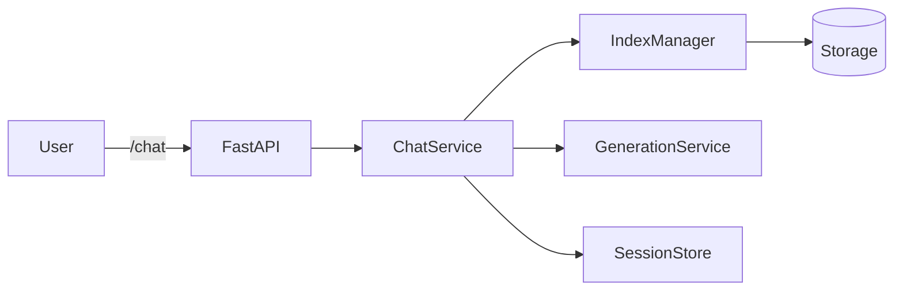

# Architecture

## Runtime (Chat)


- ChatService: builds prompts, fetches history, retrieves context, formats citations
- IndexManager: per-course storage of vector indices (FAISS now)
- GenerationService: calls LLM (Groq now; Bedrock later)
- SessionStore: SQLite-based session/message persistence

## Ingestion/Indexing
```mermaid
flowchart TD
  A[Activity: resource/forum/etc] -->|/activities| API
  API --> BP[Background Processing]
  BP --> DL[Download]
  DL --> EX[Extract Text]
  EX --> CHK[Chunk]
  CHK --> EMB[Embed]
  EMB --> IDX[Index (per-course)]
```

- Extract via LlamaIndex readers for PDF/PPTX/DOCX
- Chunking by sentence or semantic boundaries
- Indexing per course; persisted to disk under `storage/`

## Frontend
- Minimal tester app under `frontend/` with an additional floating chat widget for `course_id=math`.
- Replace with proper product UI later. 