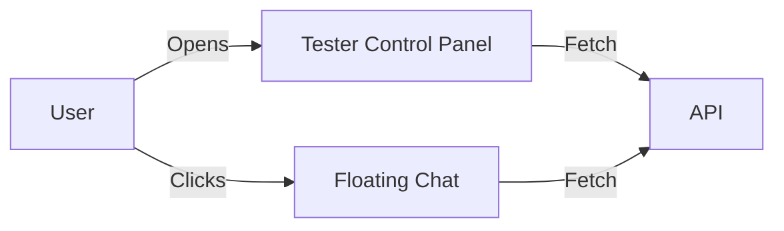

# Frontend Tester

Two ways to test:
1. Control panel (create/end/delete sessions, send messages)
2. Floating chat widget (bottom-right) for `course_id=math`



## Run
```bash
python3 -m http.server 8080
# open http://127.0.0.1:8080/frontend/index.html
```

## Settings
- API base defaults to `http://127.0.0.1:8000`
- Widget auto-creates a session on open and ends+deletes on close 